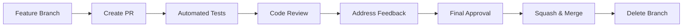

# Branch Protection e Merge Rules

Este documento descreve as regras de proteção de branch e merge para o projeto.

## 🛡️ Proteção de Branches

### Branch Principal (`main`)
- ✅ Require pull request reviews before merging
- ✅ Require review from code owners
- ✅ Dismiss stale PR approvals when new commits are pushed
- ✅ Require status checks to pass before merging
- ✅ Require branches to be up to date before merging
- ✅ Require conversation resolution before merging
- ✅ Restrict pushes that create files larger than 100 MB

### Branch de Desenvolvimento (`dev`)
- ✅ Require pull request reviews before merging
- ✅ Require status checks to pass before merging
- ✅ Require branches to be up to date before merging

## 🔍 Status Checks Obrigatórios

Os seguintes checks devem passar antes do merge:

### Testes Automatizados
- `🧪 Automated Tests (ubuntu-latest)`
- `🧪 Automated Tests (windows-latest)`
- `🧪 Automated Tests (macos-latest)`

### Qualidade de Código
- `📋 PR Information Validation`
- `🔒 Security Check`
- `⚡ Performance Check`

### Build
- Build deve passar em todas as plataformas suportadas

## 👥 Code Owners

Configure o arquivo `.github/CODEOWNERS` para definir revisores automáticos:

```
# Global owners
* @alexkads

# Frontend específico
/src/ @alexkads
/src/components/ @alexkads

# Backend específico  
/src-tauri/ @alexkads

# Configurações críticas
/src-tauri/tauri.conf.json @alexkads
/src-tauri/capabilities/ @alexkads
/.github/ @alexkads
/package.json @alexkads
/Cargo.toml @alexkads

# Documentação
/docs/ @alexkads
/*.md @alexkads
```

## 🔄 Processo de Merge

### 1. Tipos de Merge Permitidos
- ✅ **Squash and merge** (recomendado para features)
- ✅ **Rebase and merge** (para manter histórico linear)
- ❌ **Create a merge commit** (evitado para manter histórico limpo)

### 2. Fluxo de Trabalho



### 3. Convenções de Commit

Siga o padrão [Conventional Commits](https://www.conventionalcommits.org/):

```
<type>[optional scope]: <description>

[optional body]

[optional footer(s)]
```

**Tipos permitidos:**
- `feat`: nova funcionalidade
- `fix`: correção de bug
- `docs`: documentação
- `style`: formatação, espaços em branco, etc.
- `refactor`: refatoração de código
- `perf`: melhoria de performance
- `test`: adição ou correção de testes
- `build`: mudanças no sistema de build
- `ci`: mudanças no CI/CD
- `chore`: tarefas de manutenção
- `revert`: reverter commit anterior

## 📊 Métricas de Quality Gate

### Coverage Mínimo
- **Frontend**: 80%
- **Backend (Rust)**: 75%

### Performance Thresholds
- **Bundle size**: Não deve aumentar mais que 10%
- **Build time**: Não deve exceder 5 minutos
- **Test execution**: Não deve exceder 2 minutos

## 🚨 Regras de Exceção

### Hotfixes Críticos
Em caso de bugs críticos em produção:

1. Criar branch `hotfix/nome-do-fix` a partir de `main`
2. Implementar correção mínima
3. Criar PR com label `hotfix`
4. Revisor pode aprovar bypass de alguns checks (apenas security mantido)
5. Merge direto para `main`
6. Cherry-pick para `develop`

### Releases
- Branches `release/*` têm regras especiais
- Apenas documentação e correções menores permitidas
- No new features

## 🔧 Configuração Automática

Para aplicar essas regras automaticamente, use a GitHub CLI:

```bash
# Proteção do branch main
gh api repos/:owner/:repo/branches/main/protection \
  --method PUT \
  --field required_status_checks='{"strict":true,"contexts":["🧪 Automated Tests (ubuntu-latest)","🧪 Automated Tests (windows-latest)","🧪 Automated Tests (macos-latest)","📋 PR Information Validation","🔒 Security Check"]}' \
  --field enforce_admins=true \
  --field required_pull_request_reviews='{"required_approving_review_count":1,"dismiss_stale_reviews":true,"require_code_owner_reviews":true}' \
  --field restrictions=null

# Proteção do branch dev (se existir)
gh api repos/:owner/:repo/branches/dev/protection \
  --method PUT \
  --field required_status_checks='{"strict":true,"contexts":["🧪 Automated Tests (ubuntu-latest)","📋 PR Information Validation","🔒 Security Check"]}' \
  --field enforce_admins=false \
  --field required_pull_request_reviews='{"required_approving_review_count":1,"dismiss_stale_reviews":false,"require_code_owner_reviews":false}' \
  --field restrictions=null

# Configurar merge methods
gh api repos/:owner/:repo \
  --method PATCH \
  --field allow_squash_merge=true \
  --field allow_merge_commit=false \
  --field allow_rebase_merge=true \
  --field delete_branch_on_merge=true
```
