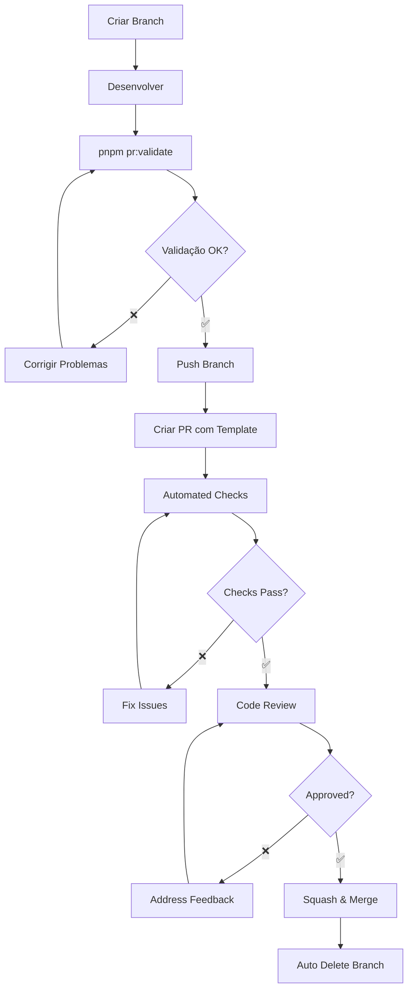

# 📋 Estrutura de Pull Request - Resumo

Esta é a estrutura completa de Pull Requests criada para o projeto Open Cleaner RN.

## 🗂️ Arquivos Criados/Modificados

### Templates de PR
- `.github/PULL_REQUEST_TEMPLATE.md` - Template principal (melhorado)
- `.github/pull_request_template/feature.md` - Template para features
- `.github/pull_request_template/bugfix.md` - Template para bug fixes
- `.github/pull_request_template/documentation.md` - Template para documentação
- `.github/pull_request_template/refactoring.md` - Template para refatoração

### Workflows e Automação
- `.github/workflows/pr-validation.yml` - Workflow de validação automática
- `.github/CODEOWNERS` - Definição de code owners
- `.github/BRANCH_PROTECTION.md` - Documentação de proteção de branches

### Scripts Utilitários
- `scripts/setup-branch-protection.sh` - Script para configurar proteção automática
- `scripts/validate-pr.sh` - Script de validação pré-PR
- `package.json` - Comandos adicionados: `pr:validate`, `pr:setup`

### Documentação
- `.github/PR_GUIDE.md` - Guia completo de Pull Requests
- `CONTRIBUTING.md` - Atualizado com seção sobre PRs

## 🚀 Como Usar

### 1. Configuração Inicial (uma vez)
```bash
# Configurar proteção de branches automaticamente
pnpm pr:setup
```

### 2. Antes de Criar um PR
```bash
# Validar se está tudo pronto
pnpm pr:validate
```

### 3. Criando um PR
1. **Escolha o template apropriado**:
   - Bug fix: `?template=bugfix.md`
   - Feature: `?template=feature.md`
   - Documentation: `?template=documentation.md`
   - Refactoring: `?template=refactoring.md`

2. **URL com template**:
   ```
   https://github.com/alexkads/open-cleaner-rn/compare/main...sua-branch?template=feature.md
   ```

## ✅ Funcionalidades Implementadas

### Validação Automática
- ✅ Validação de título do PR (Conventional Commits)
- ✅ Verificação de descrição mínima
- ✅ Verificação de issues linkadas
- ✅ Testes automatizados multi-plataforma
- ✅ Verificação de segurança
- ✅ Análise de performance
- ✅ Verificação de acessibilidade (quando aplicável)

### Code Review
- ✅ Code owners definidos
- ✅ Reviews obrigatórios
- ✅ Status checks obrigatórios
- ✅ Resolução de conversas obrigatória

### Branch Protection
- ✅ Branch `main` protegido
- ✅ Squash merge configurado
- ✅ Auto-delete de branches
- ✅ Prevent force pushes

### Templates Específicos
- ✅ **Bug Fix**: Root cause analysis, steps to reproduce, verification
- ✅ **Feature**: Requirements, implementation details, demo
- ✅ **Documentation**: Target audience, quality checklist, integration
- ✅ **Refactoring**: Architecture changes, metrics, validation

## 🎯 Benefícios

### Para Desenvolvedores
- **Guidance**: Templates guiam na criação de PRs completos
- **Validation**: Scripts detectam problemas antes do PR
- **Efficiency**: Processo padronizado e automático

### Para Code Review
- **Context**: Informações estruturadas facilitam review
- **Quality**: Checks automáticos garantem qualidade mínima
- **Consistency**: Padrão uniforme em todos os PRs

### Para o Projeto
- **History**: Histórico limpo e informativo
- **Security**: Verificações automáticas de segurança
- **Performance**: Monitoramento de impacto
- **Documentation**: PRs bem documentados

## 🔄 Fluxo de Trabalho



## 📊 Status Checks

### Obrigatórios para Merge
1. **🧪 Automated Tests** (todas as plataformas)
2. **📋 PR Information Validation**
3. **🔒 Security Check**
4. **⚡ Performance Check**
5. **👥 Code Review** (1+ approval)

### Opcionais/Informativos
- **♿ Accessibility Check** (para mudanças de UI)
- **📦 Bundle Size Analysis**
- **📊 Test Coverage Report**

## 🛠️ Comandos Úteis

```bash
# Validar PR antes de criar
pnpm pr:validate

# Configurar proteção de branches
pnpm pr:setup

# Comandos de desenvolvimento
pnpm lint              # Verificar lint
pnpm format            # Formatar código
pnpm type-check        # Verificar tipos
pnpm test:coverage     # Executar testes com coverage
pnpm build             # Testar build
```

## 📚 Documentação Relacionada

- [PR_GUIDE.md](.github/PR_GUIDE.md) - Guia completo de Pull Requests
- [BRANCH_PROTECTION.md](.github/BRANCH_PROTECTION.md) - Configurações de proteção
- [CONTRIBUTING.md](CONTRIBUTING.md) - Guia de contribuição geral

## 🔄 Próximos Passos

1. **Executar configuração inicial**:
   ```bash
   pnpm pr:setup
   ```

2. **Testar o processo** criando um PR de teste

3. **Treinar a equipe** com o novo processo

4. **Monitorar métricas** de qualidade dos PRs

5. **Iterar e melhorar** baseado no feedback

## 🎉 Conclusão

A estrutura de Pull Request está completa e pronta para uso! Ela fornece:

- **Guidance** para desenvolvedores
- **Automation** para qualidade
- **Consistency** no processo
- **Documentation** clara e útil

Com esta estrutura, os PRs serão mais informativos, seguros e fáceis de revisar, melhorando significativamente a qualidade e eficiência do desenvolvimento.
